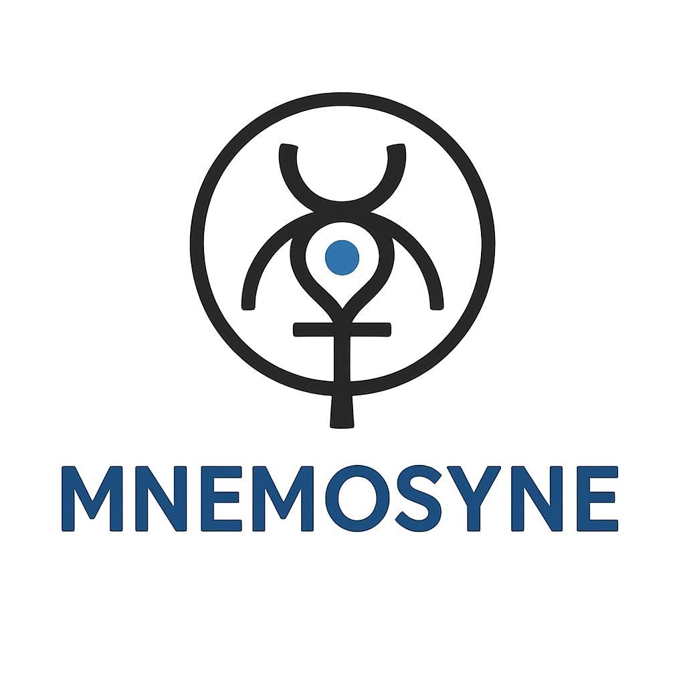

# Mnemosyne

<div align="center">
  
  
  <h3>Professional AI Agent Platform for Obsidian</h3>
  <p><em>Transform your knowledge vault into an intelligent assistant with multiple specialized AI agents</em></p>

  [](https://opensource.org/licenses/MIT)
  [](https://www.typescriptlang.org/)
  [](https://reactjs.org/)
  [](https://tailwindcss.com/)
  [](https://obsidian.md/)
</div>

---

## 🌟 Overview

**Mnemosyne** (named after the Greek goddess of memory) is a professional AI agent platform that transforms your Obsidian vault into an intelligent knowledge assistant. With advanced RAG capabilities, multiple specialized AI agents, and hybrid local/cloud AI support, Mnemosyne represents the next evolution in personal knowledge management.

### ✨ Key Features

- 🤖 **Multi-Agent Platform** - Multiple specialized AI assistants for different domains and tasks
- 🧠 **Advanced RAG** - Intelligent chunking, semantic search, and contextual retrieval
- 🔒 **Hybrid AI Support** - Local privacy with Ollama + cloud power with OpenAI/Anthropic/Claude
- 🛡️ **Enterprise Security** - AES-256 encryption with vault-scoped key management
- 💎 **Modern UI** - Professional React + Tailwind interface with native Obsidian integration
- ⚡ **High Performance** - Optimized for speed and memory efficiency
- 🔧 **Zero Dependencies** - Works completely standalone within Obsidian

---

## 🚀 Quick Start

### Prerequisites

- **Obsidian** 1.4.0 or later
- **Node.js** 18.0+ (for development)
- At least one AI provider API key (OpenAI, Anthropic, or local Ollama setup)

### Installation

#### Option 1: From Obsidian Community Plugins (Coming Soon)
1. Open Obsidian Settings
2. Go to Community Plugins
3. Search for "Mnemosyne"
4. Install and enable

#### Option 2: Manual Installation
1. Download the latest release from [Releases](../../releases)
2. Extract to your vault's `.obsidian/plugins/mnemosyne/` folder
3. Enable the plugin in Obsidian settings

#### Option 3: Development Setup
```bash
# Clone the repository
git clone https://github.com/dunnock/mnemosyne.git
cd mnemosyne

# Install dependencies
npm install

# Build the plugin
npm run build

# Link to your test vault
ln -s $(pwd) /path/to/your/vault/.obsidian/plugins/mnemosyne
```

### Initial Configuration

1. **Set Master Password**: Open Mnemosyne settings and create a secure master password for API key encryption
2. **Configure AI Provider**: Add your OpenAI, Anthropic, or local Ollama endpoint
3. **Choose Vector Backend**: Select the appropriate vector store backend for your vault size (see below)

---

## ⚙️ Vector Store Configuration

### Using JSON Backend (Default)

No configuration needed! JSON backend works out of the box:

```
Settings → Mnemosyne → Vector Store → Backend: JSON File
```

Your vector index will be stored in `vector-store-index.json` in your vault's plugin folder.

### Using SQLite Backend (Recommended)

Perfect for most users - combines simplicity with performance:

1. Open **Settings → Mnemosyne → Vector Store**
2. Select **SQLite + VSS** from the backend dropdown
3. Optionally customize:
   - Database Path: `vector-store.db` (default)
   - Enable WAL Mode: ✓ (recommended for better concurrency)
4. Click **Save Configuration**

**Migrating from JSON:**
- Click **Migrate to SQLite** button
- Wait for migration to complete
- Your original JSON data is preserved

**Benefits:**
- ✅ Zero external setup (embedded database)
- ✅ 2-3x faster search than JSON
- ✅ Lower memory usage
- ✅ Single file backup (just copy the .db file)
- ✅ ACID transaction safety

### Using PostgreSQL Backend

For large vaults or advanced deployments.

**📘 Quick Start**: See [DOCKER_SETUP.md](DOCKER_SETUP.md) for a complete Docker-based setup guide.

#### 1. Setup PostgreSQL with pgvector

**Using Docker (Recommended):**
```bash
docker run -d \
  --name mnemosyne-postgres \
  -e POSTGRES_PASSWORD=yourpassword \
  -e POSTGRES_DB=mnemosyne \
  -p 5432:5432 \
  pgvector/pgvector:pg16
```

**Using Docker Compose:**
```yaml
version: '3.8'
services:
  postgres:
    image: pgvector/pgvector:pg16
    environment:
      POSTGRES_DB: mnemosyne
      POSTGRES_USER: postgres
      POSTGRES_PASSWORD: yourpassword
    ports:
      - "5432:5432"
    volumes:
      - pgdata:/var/lib/postgresql/data

volumes:
  pgdata:
```

**Manual Installation:**
```bash
# Install PostgreSQL 14+
sudo apt-get install postgresql postgresql-contrib

# Install pgvector extension
git clone https://github.com/pgvector/pgvector.git
cd pgvector
make
sudo make install

# Enable extension
psql -U postgres -c "CREATE EXTENSION vector;"
```

#### 2. Configure in Mnemosyne

1. Open **Settings → Mnemosyne → Vector Store**
2. Select **PostgreSQL + pgvector** from backend dropdown
3. Enter connection details:
   - Host: `localhost` (or your server IP)
   - Port: `5432`
   - Database: `mnemosyne`
   - User: `postgres`
   - Password: `yourpassword`
   - SSL: Enable if using remote server
4. Click **Test Connection** to verify
5. Click **Save Configuration**

#### 3. Migration (Optional)

To migrate existing data:
- Click **Migrate to PostgreSQL** button
- Monitor real-time progress
- Verify chunk count matches source

**Benefits:**
- ✅ Scales to millions of chunks
- ✅ HNSW indexing for ultra-fast search
- ✅ Connection pooling for concurrency
- ✅ Professional-grade reliability
- ✅ Multi-vault support

### Performance Comparison

| Vault Size | JSON | SQLite | PostgreSQL |
|------------|------|--------|------------|
| 1K chunks | ~10ms | ~8ms | ~5ms |
| 10K chunks | ~50ms | ~25ms | ~10ms |
| 100K chunks | N/A (too slow) | ~100ms | ~15ms |
| 1M chunks | N/A | N/A | ~20ms |

*Search times are averages for semantic similarity queries with k=5 results*

---

## 🎯 Core Capabilities

### 🤖 Intelligent Agent System
- **Pre-built Templates** - 10+ professional agent templates for common use cases
- **Custom Agents** - Create specialized assistants tailored to your workflow
- **Agent Chaining** - Combine multiple agents for complex reasoning tasks
- **Performance Analytics** - Track usage and optimize agent performance

### 🧠 Advanced RAG Engine
- **Smart Chunking** - Context-aware document processing with quality scoring
- **Semantic Search** - Vector-based content retrieval using state-of-the-art embeddings
- **Folder Awareness** - Contextual search within project hierarchies
- **Batch Processing** - Efficient vault-wide operations
- **Multi-Backend Storage** - Choose from JSON, SQLite, or PostgreSQL based on vault size

#### 📊 Vector Store Backends

Mnemosyne supports three vector storage backends, each optimized for different vault sizes:

| Backend | Best For | Setup | Performance | Scalability |
|---------|----------|-------|-------------|-------------|
| **JSON File** | Small vaults (0-10K chunks) | Zero setup | Fast for small datasets | Limited to ~10K chunks |
| **SQLite + VSS** | Medium vaults (10K-100K chunks) | Zero setup, embedded | 2-3x faster than JSON | Scales to 100K chunks |
| **PostgreSQL + pgvector** | Large vaults (100K+ chunks) | Requires PostgreSQL server | Fastest with HNSW indexing | Millions of chunks |

**Choosing a Backend:**

- **JSON** (Default) - Perfect for getting started, works out of the box, ideal for smaller personal vaults
- **SQLite** - Recommended sweet spot for most users, zero external setup with significantly better performance
- **PostgreSQL** - For power users with large knowledge bases or requiring multi-vault setups

All backends support seamless migration, so you can start with JSON and upgrade as your vault grows.

### 🔒 Enterprise-Grade Security
- **AES-256 Encryption** - Military-grade API key protection
- **Vault-Scoped Keys** - Unique encryption per vault for maximum security
- **Zero-Knowledge** - Master password never stored or transmitted
- **Local Privacy** - Option for 100% local processing with Ollama

### 🎨 Modern User Experience
- **React Interface** - Professional, responsive design system
- **Dark Mode Support** - Seamless integration with Obsidian themes
- **Setup Wizard** - Guided onboarding experience
- **Real-time Feedback** - Live processing updates and error handling

---

## 🛠️ Supported AI Providers

| Provider | Models | Features | Local |
|----------|--------|----------|-------|
| **OpenAI** | GPT-4, GPT-4 Turbo, GPT-3.5 | ✅ Chat, ✅ Embeddings, ✅ Streaming | ❌ |
| **Anthropic** | Claude 3 Opus, Sonnet, Haiku | ✅ Chat, ❌ Embeddings, ✅ Streaming | ❌ |
| **Ollama** | Llama, Mistral, CodeLlama | ✅ Chat, ✅ Embeddings, ✅ Streaming | ✅ |

---

## 📖 Documentation

- 📚 **[User Guide](docs/USER_GUIDE.md)** - Complete setup and usage instructions
- 🐳 **[Docker Setup](DOCKER_SETUP.md)** - PostgreSQL + pgvector with Docker
- 🗄️ **[Vector Store Implementation](PGVECTOR_IMPLEMENTATION.md)** - Multi-backend architecture details
- 🔧 **[API Documentation](docs/API.md)** - Public API reference for developers
- 🏗️ **[Development Guide](docs/CONTRIBUTING.md)** - Contributing to Mnemosyne
- 🛡️ **[Security Policy](SECURITY.md)** - Security guidelines and reporting
- 🗺️ **[Roadmap](docs/ROADMAP.md)** - Future development plans

---

## 🎯 Use Cases

### 📝 **Research & Writing**
- **Academic Research** - Intelligent literature review and citation management
- **Content Creation** - AI-assisted writing with contextual knowledge retrieval
- **Note-Taking** - Automatic summarization and cross-referencing

### 💼 **Professional Work**
- **Project Management** - Risk analysis and decision support
- **Knowledge Management** - Team knowledge base with intelligent search
- **Documentation** - Automated documentation generation and maintenance

### 🎓 **Learning & Education**
- **Study Assistant** - Personalized tutoring based on your notes
- **Concept Mapping** - Visual knowledge connections and relationships
- **Exam Preparation** - Intelligent quiz generation and progress tracking

---

## 🔧 Development

### Tech Stack
- **Frontend**: React 18, TypeScript 5.3+, Tailwind CSS v4
- **AI/ML**: OpenAI API, Anthropic API, Ollama, Transformers.js
- **Backend**: Node.js 18+, Vector similarity search
- **Build**: ESBuild, Hot reload development
- **Testing**: Jest, React Testing Library
- **Quality**: ESLint, Prettier, Husky pre-commit hooks

### Development Commands
```bash
npm run dev          # Development mode with hot reload
npm run build        # Production build
npm run test         # Run test suite
npm run lint         # Code quality checks
npm run type-check   # TypeScript validation
```

---

## 🔧 Troubleshooting

### Vector Store Issues

#### "SQLite backend configuration missing" Error

**Cause**: Backend was switched to SQLite but configuration wasn't created.

**Solution**:
1. Open Settings → Mnemosyne → Vector Store
2. Switch to a different backend, then back to SQLite
3. The plugin will auto-create the configuration
4. Restart Obsidian

Alternatively, manually create the config by clicking **Save Configuration** after selecting SQLite.

#### PostgreSQL Connection Fails

**Common Issues:**

1. **"Connection timeout after 10 seconds"**
   - Verify PostgreSQL is running: `pg_isready`
   - Check firewall allows port 5432
   - Verify host/port are correct

2. **"password authentication failed"**
   - Double-check username and password
   - Ensure user has necessary permissions
   - Try connecting with `psql` manually to verify credentials

3. **"Extension 'vector' does not exist"**
   - Install pgvector extension:
     ```bash
     psql -U postgres -d mnemosyne -c "CREATE EXTENSION vector;"
     ```

4. **SSL Required but disabled**
   - Enable SSL in Mnemosyne settings
   - Or disable SSL requirement in PostgreSQL: `ssl = off` in `postgresql.conf`

#### Migration Stuck or Failed

**If migration appears stuck:**
- Check console for errors (Ctrl+Shift+I / Cmd+Opt+I)
- Verify target backend is accessible
- Check available disk space

**If migration fails:**
- Source data is never deleted - it's safe to retry
- Check error messages in migration progress
- Verify both backends are properly configured
- Try migrating in smaller batches (restart migration)

#### Performance Issues

**JSON backend slow:**
- Consider upgrading to SQLite for 2-3x speed improvement
- Reduce vault size by excluding folders in RAG settings

**SQLite backend slow:**
- Enable WAL mode in settings (improves concurrent access)
- Run VACUUM: Delete `.db` file and re-ingest (or run maintenance in UI)
- Consider PostgreSQL for vaults >100K chunks

**PostgreSQL slow searches:**
- Verify HNSW index exists:
  ```sql
  SELECT indexname FROM pg_indexes WHERE tablename = 'embeddings';
  ```
- Increase `work_mem` in PostgreSQL config
- Check query performance with `EXPLAIN ANALYZE`

#### Memory Issues

**"Out of memory" during ingestion:**
- Use batch processing (enabled by default)
- Reduce batch size in RAG settings
- Close other memory-intensive applications
- For large vaults, use PostgreSQL instead of JSON

---

## 🤝 Contributing

We welcome contributions from the community! Please see our [Contributing Guide](CONTRIBUTING.md) for details on:

- 🐛 Bug reports and feature requests
- 🔧 Development setup and workflow
- 📝 Documentation improvements
- 🧪 Testing guidelines
- 📋 Code style and standards

---

## 📄 License

This project is licensed under the MIT License - see the [LICENSE](LICENSE) file for details.

---

## 🙏 Acknowledgments

- **Obsidian Team** - For creating an incredible knowledge management platform
- **Open Source Community** - For the amazing tools and libraries that make this possible
- **Beta Testers** - For invaluable feedback and bug reports
- **Mnemosyne** - The Greek goddess of memory who inspired this project

---

## 📞 Support

- 🐛 **Bug Reports**: [GitHub Issues](../../issues)
- 💬 **Discussions**: [GitHub Discussions](../../discussions)
- 📧 **Security Issues**: See [SECURITY.md](SECURITY.md)
- 💡 **Feature Requests**: [GitHub Issues](../../issues) with `enhancement` label

---

<div align="center">
  <strong>Transform your knowledge. Amplify your intelligence. Remember everything.</strong>
  
  <br><br>
  
  Made with ❤️ for the Obsidian community
</div>
